  

I build web apps, streaming platforms and open-source projects. I forge ideas into things people can open in a browser.

---

## About

Hi, I'm Saptarshi, a developer and creator. I make websites, software and digital experiences, from the layout to the last line of code.

My work centres on the web: fast pages, clean interfaces and tools that feel good to use. I also design posters, build APIs and Android apps, and write in Python, C, C++ and Java.

*Code. Build. Create. Repeat.*

| | |
|---|---|
| **Name** | Saptarshi Samanta |
| **Brand** | RISHI FORGE |
| **Based in** | Kolkata, West Bengal |
| **Focus** | Web, APIs, apps, design |
| **Instagram** | [@saaptaarshii](https://instagram.com/saaptaarshii) |

---

## Location

I'm based in Kolkata, West Bengal. The nearest airport is Netaji Subhas Chandra Bose International Airport, code CCU, about 13 km north-east of the city centre.

  

[Kolkata on Maps](https://www.google.com/maps/search/?api=1&query=Kolkata%2C+West+Bengal) · [CCU airport on Maps](https://www.google.com/maps/search/?api=1&query=22.6547%2C88.4467)

---

## Project

### EV STREAMS
**All global OTT, sports, IPTV and live TV. A free streaming hub.**

One browser-based hub for global OTT, sports and IPTV channels, plus live TV. Football, cricket, basketball, tennis, motorsports and more, free to watch and built to work on any screen size.

`Live TV` `Sports` `Entertainment` `Content discovery` `Responsive` `Modern UI`

---

## Stack

| Languages | Web | Tools | Design |
|---|---|---|---|
| Python | HTML | Git and GitHub | UI and UX |
| C and C++ | CSS | GitHub Pages | Branding |
| Java | JavaScript | Android apps | Poster design |
| | Responsive UI, APIs | | |

  

---

## Let's build something

📧 **[saptarshirishi11@gmail.com](mailto:saptarshirishi11@gmail.com)**

*© Saptarshi Samanta. Forge your ideas. Build the future.*

